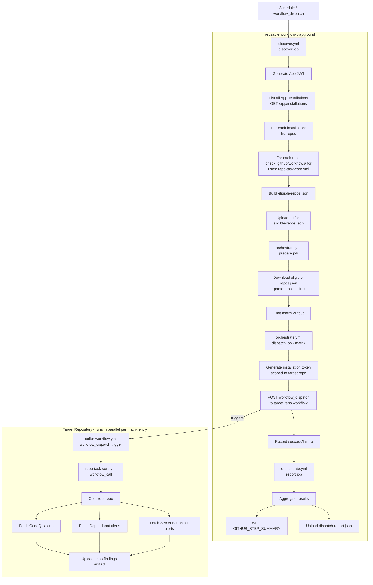

# GitHub App Orchestration Architecture

**Repository:** `reusable-workflow-playground`
**Purpose:** Orchestrate GHAS findings collection across multiple target repositories using a GitHub App for authentication and discovery.

---

## Table of Contents

1. [System Overview](#1-system-overview)
2. [GitHub App Configuration](#2-github-app-configuration)
3. [Workflow Files](#3-workflow-files)
4. [Job and Step Breakdown](#4-job-and-step-breakdown)
5. [Data Flow Diagram](#5-data-flow-diagram)
6. [Secrets Reference](#6-secrets-reference)
7. [App Token Generation](#7-app-token-generation)
8. [Passing Data Between Jobs](#8-passing-data-between-jobs)
9. [Rate Limiting and Parallelism](#9-rate-limiting-and-parallelism)
10. [Limitations and Edge Cases](#10-limitations-and-edge-cases)

---

## 1. System Overview

The orchestration system consists of three layers:

| Layer | Location | Purpose |
|---|---|---|
| **Reusable Core** | This repo: `.github/workflows/repo-task-core.yml` | Performs the actual GHAS data collection; called by target repos |
| **Orchestrator** | This repo: `.github/workflows/` | Discovers eligible repos and dispatches `workflow_dispatch` events |
| **Target Repos** | Each installed repo | Contains a caller workflow that invokes `repo-task-core.yml` via `workflow_call` |

### Execution Model

```
Schedule / manual trigger
        │
        ▼
  [orchestrator repo]
  discover.yml
  ├── List all App installations (paginated)
  ├── For each installed repo: check .github/workflows/ for uses: repo-task-core.yml
  └── Output: eligible_repos JSON array
        │
        ▼
  orchestrate.yml  (called by discover.yml or triggered manually)
  ├── For each eligible repo: generate installation token
  ├── Trigger workflow_dispatch on target repo's caller workflow
  └── Collect and report per-repo status
        │
        ▼
  [target repo]
  caller-workflow.yml  (e.g. ghas-scan.yml)
  └── uses: <org>/reusable-workflow-playground/.github/workflows/repo-task-core.yml@main
```

---

## 2. GitHub App Configuration

### 2.1 App Creation

Create the GitHub App at: `https://github.com/organizations/<org>/settings/apps/new`
(or at the user level: `https://github.com/settings/apps/new`)

**App Settings:**
- **Name:** `repo-task-orchestrator` (or similar)
- **Homepage URL:** URL of this repository
- **Webhook:** Disabled (not needed for this polling-based design)
- **Where can this GitHub App be installed?** Any account (or restrict to your org)

### 2.2 Required Permissions

#### Repository Permissions

| Permission | Level | Justification |
|---|---|---|
| **Contents** | Read | Read `.github/workflows/` files to detect `uses:` references to `repo-task-core.yml` |
| **Actions** | Write | Trigger `workflow_dispatch` events on target repositories |
| **Metadata** | Read | Required by GitHub for all Apps; allows listing repo metadata |

#### Organization Permissions

| Permission | Level | Justification |
|---|---|---|
| **Members** | Read | Optional — only needed if you want to filter repos by org membership |

> **Note:** No `security_events` permission is needed on the App itself. The target repo's `github.token` (auto-issued when the caller workflow runs) already has `security_events: read` scope for GHAS API calls within that repo.

### 2.3 Installation

Install the App on every target repository (or on the entire organization). The App installation creates an **installation ID** per account/org, which is used to generate scoped installation access tokens.

After installation, note the **App ID** (visible on the App settings page) and generate a **private key** (PEM format) from the App settings.

---

## 3. Workflow Files

### 3.1 Recommended Approach: Two Separate Workflows

Keeping discovery and orchestration in separate workflow files is recommended because:

- **Separation of concerns** — discovery is read-only; orchestration has side effects
- **Independent re-triggering** — you can re-run orchestration with a manually supplied repo list without re-running discovery
- **Cleaner job output boundaries** — avoids very large single-workflow files
- **Easier debugging** — failures are isolated to one phase

### 3.2 Workflow File Summary

| File | Trigger | Purpose |
|---|---|---|
| `.github/workflows/repo-task-core.yml` | `workflow_call` | **Existing.** Core GHAS collection logic; called by target repos |
| `.github/workflows/discover.yml` | `schedule`, `workflow_dispatch` | Discovers eligible repos; outputs JSON list |
| `.github/workflows/orchestrate.yml` | `workflow_run` (after discover), `workflow_dispatch` | Generates tokens, dispatches to targets, reports results |

---

## 4. Job and Step Breakdown

### 4.1 `discover.yml` — Repository Discovery Workflow

```
Trigger: schedule (e.g. daily) OR workflow_dispatch
```

#### Job: `discover`

| Step | Action / Tool | Purpose |
|---|---|---|
| `generate-app-token` | `tibdex/github-app-token@v2` | Mint a short-lived JWT → exchange for installation token scoped to this (orchestrator) repo |
| `list-installations` | `gh api` with pagination | Call `GET /app/installations` to get all installation IDs and account names |
| `list-repos-per-installation` | `gh api` with pagination | For each installation ID, call `GET /user/installations/{id}/repositories` or `GET /installation/repositories` to enumerate repos |
| `check-workflow-references` | `gh api` + `grep`/`jq` | For each repo, fetch `.github/workflows/` file list, then fetch each YAML and grep for `uses:.*repo-task-core.yml` |
| `build-eligible-list` | `jq` | Assemble JSON array: `[{"repo":"org/name","workflow_file":"ghas-scan.yml"}, ...]` |
| `upload-eligible-repos` | `actions/upload-artifact@v4` | Save `eligible-repos.json` as a workflow artifact for consumption by `orchestrate.yml` |
| `set-output` | `echo` to `$GITHUB_OUTPUT` | Also expose the JSON as a job output for same-run chaining |

**Job Output:**
```json
[
  { "repo": "myorg/repo-a", "workflow_file": "ghas-scan.yml" },
  { "repo": "myorg/repo-b", "workflow_file": "security-scan.yml" }
]
```

**Key design note:** The App token used in `discover.yml` must be generated using the **App-level JWT** (not an installation token) to call `GET /app/installations`. This requires the `tibdex/github-app-token` action with no `installation_id` override — it defaults to the installation on the current repository, but for listing all installations you need to use the raw JWT. See [Section 7](#7-app-token-generation) for details.

---

### 4.2 `orchestrate.yml` — Dispatch and Reporting Workflow

```
Trigger: workflow_run (on: discover.yml completed) OR workflow_dispatch (with repo_list input)
```

#### Inputs (for `workflow_dispatch`):

| Input | Type | Default | Purpose |
|---|---|---|---|
| `repo_list` | string | `''` | JSON array of `{"repo":"...","workflow_file":"..."}` objects; overrides artifact if provided |
| `dry_run` | boolean | `false` | Passed through to each target workflow's `dry_run` input |
| `runner` | string | `ubuntu-latest` | Runner label passed through to target workflows |

#### Job: `prepare`

| Step | Purpose |
|---|---|
| Download artifact `eligible-repos.json` from the triggering `discover` run (if triggered via `workflow_run`) OR parse `repo_list` input (if triggered via `workflow_dispatch`) | Normalize the repo list into a consistent JSON array |
| Emit `matrix` job output containing the JSON array | Feed the dispatch job's matrix strategy |

#### Job: `dispatch` (matrix, depends on `prepare`)

**Matrix strategy:** `matrix: repo: ${{ fromJson(needs.prepare.outputs.matrix) }}`

| Step | Action / Tool | Purpose |
|---|---|---|
| `generate-installation-token` | `tibdex/github-app-token@v2` with `installation_retrieval_mode: repository` and `installation_retrieval_payload: <target-repo>` | Mint a token scoped to the **target** repository |
| `trigger-workflow` | `gh workflow run` or `gh api POST /repos/{repo}/actions/workflows/{workflow}/dispatches` | Trigger `workflow_dispatch` on the target repo's caller workflow, passing `dry_run` and `runner` inputs |
| `record-result` | `echo` to step output | Capture HTTP status / success flag per repo |

**Parallelism control:**
```yaml
strategy:
  matrix:
    repo: ${{ fromJson(needs.prepare.outputs.matrix) }}
  max-parallel: 5   # Limit concurrent dispatches to avoid secondary rate limits
  fail-fast: false  # Continue dispatching to other repos even if one fails
```

#### Job: `report` (depends on `dispatch`, runs `if: always()`)

| Step | Purpose |
|---|---|
| Collect per-repo outcomes from matrix job outputs | Aggregate success/failure counts |
| Write summary to `$GITHUB_STEP_SUMMARY` | Render a Markdown table in the Actions UI |
| Upload `dispatch-report.json` artifact | Persist results for audit/downstream use |

---

### 4.3 `repo-task-core.yml` — Existing Reusable Workflow (unchanged)

This workflow is **not modified**. Target repositories call it via:

```yaml
jobs:
  task:
    uses: <org>/reusable-workflow-playground/.github/workflows/repo-task-core.yml@main
    with:
      dry_run: ${{ inputs.dry_run }}
      runner: ${{ inputs.runner }}
    secrets:
      EXTERNAL_API_KEY: ${{ secrets.EXTERNAL_API_KEY }}
```

The `github.token` inside `repo-task-core.yml` is automatically scoped to the **target repository** when called via `workflow_call`, giving it the necessary `contents: read` and `security_events: read` permissions without any explicit token passing.

---

## 5. Data Flow Diagram



---

## 6. Secrets Reference

All secrets are stored in the **`reusable-workflow-playground` repository secrets** (Settings → Secrets and variables → Actions).

| Secret Name | Value | Used By | Purpose |
|---|---|---|---|
| `APP_ID` | Numeric App ID (e.g. `123456`) | `discover.yml`, `orchestrate.yml` | Identifies the GitHub App when generating JWTs |
| `APP_PRIVATE_KEY` | PEM-encoded RSA private key (full contents of the `.pem` file downloaded from App settings) | `discover.yml`, `orchestrate.yml` | Signs the JWT used to authenticate as the App |

> **Security note:** The private key should be stored as a multi-line secret. GitHub Actions handles multi-line secrets correctly. Never commit the `.pem` file to the repository.

### Optional / Future Secrets

| Secret Name | Purpose |
|---|---|
| `EXTERNAL_API_KEY` | Passed through to `repo-task-core.yml` for future LLM/external API integration (currently unused) |

---

## 7. App Token Generation

### 7.1 How GitHub App Authentication Works

GitHub App authentication is a two-step process:

```
Step 1: Sign a JWT using the App's private key
        JWT payload: { iss: APP_ID, iat: now-60s, exp: now+600s }
        Signed with: RS256 algorithm

Step 2: Exchange JWT for an Installation Access Token
        POST /app/installations/{installation_id}/access_tokens
        → Returns: { token: "ghs_...", expires_at: "..." }
        Token is valid for 1 hour maximum
```

### 7.2 Using `tibdex/github-app-token@v2`

This action handles both steps automatically:

```yaml
- name: Generate App token (orchestrator-scoped)
  id: app-token
  uses: tibdex/github-app-token@v2
  with:
    app_id: ${{ secrets.APP_ID }}
    private_key: ${{ secrets.APP_PRIVATE_KEY }}
    # No installation_id = defaults to installation on current repo
```

```yaml
- name: Generate installation token (target-repo-scoped)
  id: install-token
  uses: tibdex/github-app-token@v2
  with:
    app_id: ${{ secrets.APP_ID }}
    private_key: ${{ secrets.APP_PRIVATE_KEY }}
    installation_retrieval_mode: repository
    installation_retrieval_payload: ${{ matrix.repo.repo }}
    # Scopes the token to the specific target repository
```

### 7.3 Listing All Installations (App-Level JWT)

To call `GET /app/installations` (which lists all repos where the App is installed), you need a **raw App JWT**, not an installation token. The `tibdex/github-app-token` action can output the raw JWT:

```yaml
- name: Generate App JWT (for listing installations)
  id: app-jwt
  uses: tibdex/github-app-token@v2
  with:
    app_id: ${{ secrets.APP_ID }}
    private_key: ${{ secrets.APP_PRIVATE_KEY }}
    # Use the JWT directly for /app/installations endpoint
```

Then use `GH_TOKEN=${{ steps.app-jwt.outputs.token }}` with `gh api /app/installations --paginate`.

> **Alternative:** Use `actions/create-github-app-token@v1` (the official GitHub action), which also supports listing installations and generating per-repo tokens. Either action is suitable; `tibdex/github-app-token@v2` is more widely used in the community.

### 7.4 Token Scoping Summary

| Token Type | Scope | Used For |
|---|---|---|
| App JWT | App-level | `GET /app/installations` — list all installations |
| Installation token (orchestrator repo) | This repo only | `GET /installation/repositories` — list repos in an installation |
| Installation token (target repo) | Target repo only | `POST /repos/{repo}/actions/workflows/{id}/dispatches` |

---

## 8. Passing Data Between Jobs

### 8.1 Within the Same Workflow Run (Job Outputs)

For the `prepare` → `dispatch` handoff within `orchestrate.yml`:

```yaml
jobs:
  prepare:
    outputs:
      matrix: ${{ steps.build-matrix.outputs.matrix }}
    steps:
      - id: build-matrix
        run: echo "matrix=$(cat eligible-repos.json | jq -c .)" >> $GITHUB_OUTPUT

  dispatch:
    needs: prepare
    strategy:
      matrix:
        repo: ${{ fromJson(needs.prepare.outputs.matrix) }}
```

**Limitation:** Job outputs are limited to **1 MB**. For very large repo lists (hundreds of repos), use an artifact instead and download it in the `dispatch` job.

### 8.2 Between Workflow Runs (Artifacts)

For the `discover.yml` → `orchestrate.yml` handoff (triggered via `workflow_run`):

```yaml
# In orchestrate.yml
on:
  workflow_run:
    workflows: ["Repository Discovery"]
    types: [completed]

jobs:
  prepare:
    steps:
      - name: Download eligible-repos artifact
        uses: actions/download-artifact@v4
        with:
          name: eligible-repos
          github-token: ${{ secrets.GITHUB_TOKEN }}
          run-id: ${{ github.event.workflow_run.id }}
```

**Limitation:** Artifacts from a `workflow_run` trigger must be downloaded using the triggering run's ID (`github.event.workflow_run.id`), not the current run's ID.

### 8.3 Matrix Output Aggregation

GitHub Actions does not natively aggregate matrix job outputs. To collect per-repo results in the `report` job:

- Each `dispatch` matrix job writes its result to a file named `result-<safe-repo-name>.json`
- Upload all result files as a single artifact using a wildcard pattern
- The `report` job downloads the artifact and aggregates with `jq`

---

## 9. Rate Limiting and Parallelism

### 9.1 GitHub API Rate Limits

| Limit Type | Limit | Applies To |
|---|---|---|
| REST API (authenticated) | 5,000 requests/hour per token | All `gh api` calls |
| Secondary rate limit | ~100 concurrent requests | Burst protection |
| `workflow_dispatch` | No documented hard limit, but secondary rate limits apply | Dispatch calls |
| Installation token generation | No documented limit, but tokens are cached for 1 hour | Token minting |

### 9.2 Recommended Parallelism

```yaml
strategy:
  matrix:
    repo: ${{ fromJson(needs.prepare.outputs.matrix) }}
  max-parallel: 5
  fail-fast: false
```

- **`max-parallel: 5`** — Limits concurrent `workflow_dispatch` calls to avoid secondary rate limits. Adjust based on the number of target repos (for < 20 repos, `max-parallel: 10` is safe).
- **`fail-fast: false`** — Ensures all repos are attempted even if some fail.

### 9.3 Discovery Phase Optimization

During discovery, workflow file fetching can be expensive (1 API call per file per repo). Optimize by:

1. First fetching the file **list** for `.github/workflows/` (1 call per repo)
2. Only fetching file **contents** for YAML files that could plausibly reference `repo-task-core.yml` (filter by filename pattern if known)
3. Using `--paginate` on all `gh api` calls to handle repos with many workflow files

### 9.4 Caching Eligible Repo List

The `eligible-repos.json` artifact from `discover.yml` can be reused across multiple `orchestrate.yml` runs on the same day, avoiding repeated discovery. The `orchestrate.yml` `workflow_dispatch` trigger accepts a `repo_list` input for this purpose.

---

## 10. Limitations and Edge Cases

### 10.1 App Installation Scope

- The App must be **individually installed** on each target repository, or installed at the **organization level** (which covers all current and future repos in the org).
- If a repo is removed from the App installation, it will no longer appear in `GET /app/installations` results and will be silently skipped.
- Private repositories require the App to have explicit installation access.

### 10.2 Workflow File Detection Accuracy

The discovery step uses text matching (`grep`/`jq`) to find `uses:` references to `repo-task-core.yml`. Edge cases:

| Scenario | Behavior |
|---|---|
| Workflow uses a pinned SHA instead of `@main` | Will be detected if the grep pattern matches the repo path (not the ref) |
| Workflow uses a different branch (e.g. `@v1`) | Detected — the grep matches on the workflow file path, not the ref |
| Workflow file is in a subdirectory of `.github/workflows/` | GitHub Actions does not support subdirectories; not a concern |
| Workflow is disabled in the repo | `workflow_dispatch` will fail with a 422 error; handle gracefully in the dispatch step |
| Workflow requires `workflow_dispatch` trigger | Target caller workflow **must** declare `on: workflow_dispatch` in addition to any other triggers |

### 10.3 Token Expiry

Installation access tokens expire after **1 hour**. For large repo lists where the matrix dispatch job runs longer than 1 hour:

- Generate tokens **inside** the matrix job (per-repo), not in the `prepare` job
- This ensures each token is fresh when used

### 10.4 `workflow_run` Trigger Limitations

- `workflow_run` only triggers if the triggering workflow is on the **default branch**
- If `discover.yml` fails, `orchestrate.yml` will not be triggered (use `types: [completed]` and check `github.event.workflow_run.conclusion` in the `prepare` job)
- `workflow_run` artifacts are only accessible for **90 days** (standard artifact retention)

### 10.5 Matrix Size Limit

GitHub Actions matrices support a maximum of **256 entries**. If the number of eligible repos exceeds 256:

- Split the repo list into chunks and run multiple `orchestrate.yml` dispatches
- Or use a sequential loop inside a single job instead of a matrix strategy

### 10.6 `dry_run` Pass-Through

The `dry_run` input is passed from `orchestrate.yml` → `workflow_dispatch` payload → target caller workflow → `repo-task-core.yml`. The target caller workflow **must** declare and forward the `dry_run` input for this to work end-to-end:

```yaml
# In target repo's caller workflow
on:
  workflow_dispatch:
    inputs:
      dry_run:
        type: boolean
        default: false

jobs:
  task:
    uses: <org>/reusable-workflow-playground/.github/workflows/repo-task-core.yml@main
    with:
      dry_run: ${{ inputs.dry_run && 'true' || 'false' }}
```

### 10.7 GHAS Permissions on Target Repos

`repo-task-core.yml` calls the GHAS APIs using `github.token`. For these calls to succeed, the target repository must have:

- **GitHub Advanced Security** enabled (for CodeQL and Secret Scanning)
- **Dependabot alerts** enabled
- The caller workflow's `permissions` block must include `security-events: read` (or the repo must use the default permissive token policy)

If GHAS is not enabled, the API calls return 404 and the workflow gracefully falls back to empty JSON arrays (`|| echo '[]'`), so the workflow will not fail — but the artifacts will be empty.

### 10.8 Orchestrator Repo Permissions

The `orchestrate.yml` workflow in this repository needs the following `permissions` block:

```yaml
permissions:
  actions: read       # To download artifacts from discover.yml run
  contents: read      # Standard checkout permission
```

The App installation token (not `github.token`) is used for all cross-repo operations, so `github.token` permissions in `orchestrate.yml` can be kept minimal.

---

## Appendix: Recommended Action Versions

| Action | Version | Purpose |
|---|---|---|
| `tibdex/github-app-token` | `v2` | Generate App JWT and installation tokens |
| `actions/create-github-app-token` | `v1` | Official GitHub alternative to tibdex |
| `actions/upload-artifact` | `v4` | Upload eligible-repos and report artifacts |
| `actions/download-artifact` | `v4` | Download artifacts across workflow runs |
| `actions/checkout` | `v4` | Standard repo checkout |

> **Recommendation:** Prefer `actions/create-github-app-token@v1` for new implementations as it is the officially maintained GitHub action and supports both installation-level and repository-level token scoping natively.

---

*Document version: 1.0 — Architecture design only. No workflow YAML files have been created.*
